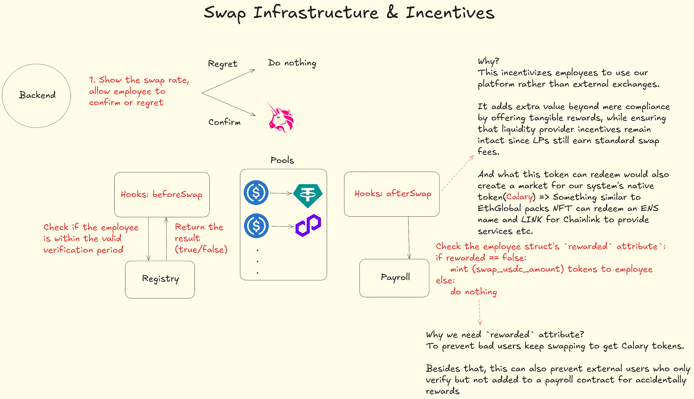

# Calary

Calary is a next-generation developer toolkit that empowers teams to build consumer-grade decentralized applications (dApps) with robust on-chain financial features and regulatory compliance baked in. At its core, Calary provides a modular suite of tools that handle end-to-end processes—from user verification and identity management to complex payroll systems and token swaps.

---

### Flow Integration

Calary integrates with **Flow** in two key areas:

1. **User Registry**: Calary stores user compliance data (wallet, passport expiry, and `rewarded` status) on the Flow blockchain. This integration ensures compliance data is stored securely and accessible across the ecosystem.
2. **Payroll Contracts**: Payroll systems such as **Time-Based Payroll**, **Custom Logic Payroll**, and **Milestone-Based Payroll** are deployed on Flow to manage salary payouts. These contracts benefit from Flow’s scalability and efficiency for handling payroll data and transactions in real time.

Both Flow integrations were achieved using Flow’s **EVM compatibility layer**, allowing seamless interaction with existing Ethereum-style smart contracts and development tools.

Check more about Calary as a developer toolkit [here](developer-toolkit.md).

### Team & Social Handles

This project was developed by a solo blockchain developer focused on smart contract development and ecosystem integration.

- **GitHub**: [cqlyj](https://github.com/cqlyj)
- **Twitter**: [luoyingjie0721](https://x.com/luoyingjie0721)

## Uniswap v4 Integration

### Project Overview

Calary leverages **Uniswap v4 Hooks** as a core component to provide a compliance-driven, reward-based swap system. The integration optimizes the swap functionality, ensuring that only verified and compliant users participate in the swap ecosystem. It also includes reward mechanisms, where users are incentivized with Calary tokens after completing a compliant swap, reinforcing the system’s compliance framework and ensuring payroll participants are rewarded.

For more use cases, check [here](./developer-toolkit.md#uniswap-v4-hooks).

### Uniswap v4 Hooks Integration

Calary uses **two custom hooks**—`beforeSwap` and `afterSwap`—to enforce compliance and trigger reward mechanisms:

1. **beforeSwap Hook**: This hook ensures that the user is verified before any swap is executed. It checks whether the user has passed the KYC process by referencing the user’s compliance status stored in the **Registry**.
2. **afterSwap Hook**: After a successful swap, this hook ensures that users who have claimed payroll and are eligible for rewards receive native Calary tokens. The hook checks the `rewarded` flag for each user and mints tokens if the flag is false. This guarantees that rewards are distributed once per claim cycle.

These hooks integrate directly into the swap logic, enabling smooth, on-chain transaction validation while maintaining regulatory compliance.

### Architecture

Below is the architecture of the Calary system, illustrating how the Uniswap v4 Hooks are integrated:



### Example & Testing

- **Testnet Deployment**: Contracts and hooks are deployed on a **testnet** for validation. The system interacts with real Uniswap v4 pairs, executing mock swaps and minting Calary tokens.
- **Smart Contract Execution**: Both `beforeSwap` and `afterSwap` hooks are implemented in Solidity and tested locally via Foundry.

```
Traces:
  [135429] Swap::run()
    ├─ [0] VM::broadcast()
    │   └─ ← [Return]
    ├─ [4834] 0x81F55140e2D2f277510d5913CEF357bc88dC185a::approve(PoolSwapTest: [0x9B6b46e2c869aa39918Db7f52f5557FE577B6eEe], 115792089237316195423570985008687907853269984665640564039457584007913129639935 [1.157e77])
    │   ├─ emit Approval(owner: 0xFB6a372F2F51a002b390D18693075157A459641F, spender: PoolSwapTest: [0x9B6b46e2c869aa39918Db7f52f5557FE577B6eEe], value: 115792089237316195423570985008687907853269984665640564039457584007913129639935 [1.157e77])
    │   └─ ← [Return] true
    ├─ [0] VM::broadcast()
    │   └─ ← [Return]
    ├─ [4834] 0xeffD7ac3073F3e4122e31fF18F9Ae69A4a595dFE::approve(PoolSwapTest: [0x9B6b46e2c869aa39918Db7f52f5557FE577B6eEe], 115792089237316195423570985008687907853269984665640564039457584007913129639935 [1.157e77])
    │   ├─ emit Approval(owner: 0xFB6a372F2F51a002b390D18693075157A459641F, spender: PoolSwapTest: [0x9B6b46e2c869aa39918Db7f52f5557FE577B6eEe], value: 115792089237316195423570985008687907853269984665640564039457584007913129639935 [1.157e77])
    │   └─ ← [Return] true
    ├─ [0] VM::broadcast()
    │   └─ ← [Return]
    ├─ [107759] PoolSwapTest::swap(PoolKey({ currency0: 0x81F55140e2D2f277510d5913CEF357bc88dC185a, currency1: 0xeffD7ac3073F3e4122e31fF18F9Ae69A4a595dFE, fee: 3000, tickSpacing: 60, hooks: 0x98d576BF36EE2eCf257396dE5f40eD9B0FBEc0C0 }), SwapParams({ zeroForOne: false, amountSpecified: 1000000 [1e6], sqrtPriceLimitX96: 1461446703485210103287273052203988822378723970341 [1.461e48] }), TestSettings({ takeClaims: false, settleUsingBurn: false }), 0x000000000000000000000000fb6a372f2f51a002b390d18693075157a459641f)
    │   ├─ [102092] PoolManager::unlock(0x0000000000000000000000000000000000000000000000000000000000000020000000000000000000000000fb6a372f2f51a002b390d18693075157a459641f0000000000000000000000000000000000000000000000000000000000000000000000000000000000000000000000000000000000000000000000000000000000000000000000000000000081f55140e2d2f277510d5913cef357bc88dc185a000000000000000000000000effd7ac3073f3e4122e31ff18f9ae69a4a595dfe0000000000000000000000000000000000000000000000000000000000000bb8000000000000000000000000000000000000000000000000000000000000003c00000000000000000000000098d576bf36ee2ecf257396de5f40ed9b0fbec0c0000000000000000000000000000000000000000000000000000000000000000000000000000000000000000000000000000000000000000000000000000f4240000000000000000000000000fffd8963efd1fc6a506488495d951d5263988d2500000000000000000000000000000000000000000000000000000000000001800000000000000000000000000000000000000000000000000000000000000020000000000000000000000000fb6a372f2f51a002b390d18693075157a459641f)
    │   │   ├─ [100051] PoolSwapTest::unlockCallback(0x0000000000000000000000000000000000000000000000000000000000000020000000000000000000000000fb6a372f2f51a002b390d18693075157a459641f0000000000000000000000000000000000000000000000000000000000000000000000000000000000000000000000000000000000000000000000000000000000000000000000000000000081f55140e2d2f277510d5913cef357bc88dc185a000000000000000000000000effd7ac3073f3e4122e31ff18f9ae69a4a595dfe0000000000000000000000000000000000000000000000000000000000000bb8000000000000000000000000000000000000000000000000000000000000003c00000000000000000000000098d576bf36ee2ecf257396de5f40ed9b0fbec0c0000000000000000000000000000000000000000000000000000000000000000000000000000000000000000000000000000000000000000000000000000f4240000000000000000000000000fffd8963efd1fc6a506488495d951d5263988d2500000000000000000000000000000000000000000000000000000000000001800000000000000000000000000000000000000000000000000000000000000020000000000000000000000000fb6a372f2f51a002b390d18693075157a459641f)
    │   │   │   ├─ [2559] 0x81F55140e2D2f277510d5913CEF357bc88dC185a::balanceOf(0xFB6a372F2F51a002b390D18693075157A459641F) [staticcall]
    │   │   │   │   └─ ← [Return] 999999999999998003000000 [9.999e23]
    │   │   │   ├─ [2559] 0x81F55140e2D2f277510d5913CEF357bc88dC185a::balanceOf(PoolManager: [0xE03A1074c86CFeDd5C142C4F04F1a1536e203543]) [staticcall]
    │   │   │   │   └─ ← [Return] 1997000000 [1.997e9]
    │   │   │   ├─ [859] PoolManager::exttload(0x83409d4e11f9013dcca2b53a92eaedb9dd49b0909e5cb642397b8b76116402db) [staticcall]
    │   │   │   │   └─ ← [Return] 0x0000000000000000000000000000000000000000000000000000000000000000
    │   │   │   ├─ [2559] 0xeffD7ac3073F3e4122e31fF18F9Ae69A4a595dFE::balanceOf(0xFB6a372F2F51a002b390D18693075157A459641F) [staticcall]
    │   │   │   │   └─ ← [Return] 997697070703 [9.976e11]
    │   │   │   ├─ [2559] 0xeffD7ac3073F3e4122e31fF18F9Ae69A4a595dFE::balanceOf(PoolManager: [0xE03A1074c86CFeDd5C142C4F04F1a1536e203543]) [staticcall]
    │   │   │   │   └─ ← [Return] 2003009297 [2.003e9]
    │   │   │   ├─ [859] PoolManager::exttload(0x00a777b1b939ce8dfaef96af610955a10387bc26489a0ad982436811f19b9b64) [staticcall]
    │   │   │   │   └─ ← [Return] 0x0000000000000000000000000000000000000000000000000000000000000000
    │   │   │   ├─ [48840] PoolManager::swap(PoolKey({ currency0: 0x81F55140e2D2f277510d5913CEF357bc88dC185a, currency1: 0xeffD7ac3073F3e4122e31fF18F9Ae69A4a595dFE, fee: 3000, tickSpacing: 60, hooks: 0x98d576BF36EE2eCf257396dE5f40eD9B0FBEc0C0 }), SwapParams({ zeroForOne: false, amountSpecified: 1000000 [1e6], sqrtPriceLimitX96: 1461446703485210103287273052203988822378723970341 [1.461e48] }), 0x000000000000000000000000fb6a372f2f51a002b390d18693075157a459641f)
    │   │   │   │   ├─ [13097] 0x98d576BF36EE2eCf257396dE5f40eD9B0FBEc0C0::beforeSwap(PoolSwapTest: [0x9B6b46e2c869aa39918Db7f52f5557FE577B6eEe], PoolKey({ currency0: 0x81F55140e2D2f277510d5913CEF357bc88dC185a, currency1: 0xeffD7ac3073F3e4122e31fF18F9Ae69A4a595dFE, fee: 3000, tickSpacing: 60, hooks: 0x98d576BF36EE2eCf257396dE5f40eD9B0FBEc0C0 }), SwapParams({ zeroForOne: false, amountSpecified: 1000000 [1e6], sqrtPriceLimitX96: 1461446703485210103287273052203988822378723970341 [1.461e48] }), 0x000000000000000000000000fb6a372f2f51a002b390d18693075157a459641f)
    │   │   │   │   │   ├─ [6924] 0x74aCE009385B13197AC36939CfF24CB3Dbd2521C::checkValidity(0xFB6a372F2F51a002b390D18693075157A459641F) [staticcall]
    │   │   │   │   │   │   └─ ← [Return] true
    │   │   │   │   │   └─ ← [Return] 0x575e24b4, 0, 0
    │   │   │   │   ├─ emit Swap(id: 0x8878a61be08b0aee98da042e042d63d95ed8274d991e6088c9df0df13c9fa0dc, sender: PoolSwapTest: [0x9B6b46e2c869aa39918Db7f52f5557FE577B6eEe], amount0: 1000000 [1e6], amount1: -1003217 [-1.003e6], sqrtPriceX96: 79237529344531561555930754913 [7.923e28], liquidity: 33837499809 [3.383e10], tick: 2, fee: 3000)
    │   │   │   │   ├─ [2183] 0x98d576BF36EE2eCf257396dE5f40eD9B0FBEc0C0::afterSwap(PoolSwapTest: [0x9B6b46e2c869aa39918Db7f52f5557FE577B6eEe], PoolKey({ currency0: 0x81F55140e2D2f277510d5913CEF357bc88dC185a, currency1: 0xeffD7ac3073F3e4122e31fF18F9Ae69A4a595dFE, fee: 3000, tickSpacing: 60, hooks: 0x98d576BF36EE2eCf257396dE5f40eD9B0FBEc0C0 }), SwapParams({ zeroForOne: false, amountSpecified: 1000000 [1e6], sqrtPriceLimitX96: 1461446703485210103287273052203988822378723970341 [1.461e48] }), 340282707203305384401838070806375643223208239 [3.402e44], 0x000000000000000000000000fb6a372f2f51a002b390d18693075157a459641f)
    │   │   │   │   │   ├─ [566] 0x74aCE009385B13197AC36939CfF24CB3Dbd2521C::checkRewardStatus(0xFB6a372F2F51a002b390D18693075157A459641F) [staticcall]
    │   │   │   │   │   │   └─ ← [Return] false
    │   │   │   │   │   └─ ← [Return] 0xb47b2fb1, 0
    │   │   │   │   └─ ← [Return] 340282707203305384401838070806375643223208239 [3.402e44]
    │   │   │   ├─ [559] 0x81F55140e2D2f277510d5913CEF357bc88dC185a::balanceOf(0xFB6a372F2F51a002b390D18693075157A459641F) [staticcall]
    │   │   │   │   └─ ← [Return] 999999999999998003000000 [9.999e23]
    │   │   │   ├─ [559] 0x81F55140e2D2f277510d5913CEF357bc88dC185a::balanceOf(PoolManager: [0xE03A1074c86CFeDd5C142C4F04F1a1536e203543]) [staticcall]
    │   │   │   │   └─ ← [Return] 1997000000 [1.997e9]
    │   │   │   ├─ [859] PoolManager::exttload(0x83409d4e11f9013dcca2b53a92eaedb9dd49b0909e5cb642397b8b76116402db) [staticcall]
    │   │   │   │   └─ ← [Return] 0x00000000000000000000000000000000000000000000000000000000000f4240
    │   │   │   ├─ [559] 0xeffD7ac3073F3e4122e31fF18F9Ae69A4a595dFE::balanceOf(0xFB6a372F2F51a002b390D18693075157A459641F) [staticcall]
    │   │   │   │   └─ ← [Return] 997697070703 [9.976e11]
    │   │   │   ├─ [559] 0xeffD7ac3073F3e4122e31fF18F9Ae69A4a595dFE::balanceOf(PoolManager: [0xE03A1074c86CFeDd5C142C4F04F1a1536e203543]) [staticcall]
    │   │   │   │   └─ ← [Return] 2003009297 [2.003e9]
    │   │   │   ├─ [859] PoolManager::exttload(0x00a777b1b939ce8dfaef96af610955a10387bc26489a0ad982436811f19b9b64) [staticcall]
    │   │   │   │   └─ ← [Return] 0xfffffffffffffffffffffffffffffffffffffffffffffffffffffffffff0b12f
    │   │   │   ├─ [1932] PoolManager::sync(0xeffD7ac3073F3e4122e31fF18F9Ae69A4a595dFE)
    │   │   │   │   ├─ [559] 0xeffD7ac3073F3e4122e31fF18F9Ae69A4a595dFE::balanceOf(PoolManager: [0xE03A1074c86CFeDd5C142C4F04F1a1536e203543]) [staticcall]
    │   │   │   │   │   └─ ← [Return] 2003009297 [2.003e9]
    │   │   │   │   └─ ← [Stop]
    │   │   │   ├─ [9320] 0xeffD7ac3073F3e4122e31fF18F9Ae69A4a595dFE::transferFrom(0xFB6a372F2F51a002b390D18693075157A459641F, PoolManager: [0xE03A1074c86CFeDd5C142C4F04F1a1536e203543], 1003217 [1.003e6])
    │   │   │   │   ├─ emit Transfer(from: 0xFB6a372F2F51a002b390D18693075157A459641F, to: PoolManager: [0xE03A1074c86CFeDd5C142C4F04F1a1536e203543], value: 1003217 [1.003e6])
    │   │   │   │   └─ ← [Return] true
    │   │   │   ├─ [2533] PoolManager::settle()
    │   │   │   │   ├─ [559] 0xeffD7ac3073F3e4122e31fF18F9Ae69A4a595dFE::balanceOf(PoolManager: [0xE03A1074c86CFeDd5C142C4F04F1a1536e203543]) [staticcall]
    │   │   │   │   │   └─ ← [Return] 2004012514 [2.004e9]
    │   │   │   │   └─ ← [Return] 1003217 [1.003e6]
    │   │   │   ├─ [10454] PoolManager::take(0x81F55140e2D2f277510d5913CEF357bc88dC185a, 0xFB6a372F2F51a002b390D18693075157A459641F, 1000000 [1e6])
    │   │   │   │   ├─ [8881] 0x81F55140e2D2f277510d5913CEF357bc88dC185a::transfer(0xFB6a372F2F51a002b390D18693075157A459641F, 1000000 [1e6])
    │   │   │   │   │   ├─ emit Transfer(from: PoolManager: [0xE03A1074c86CFeDd5C142C4F04F1a1536e203543], to: 0xFB6a372F2F51a002b390D18693075157A459641F, value: 1000000 [1e6])
    │   │   │   │   │   └─ ← [Return] true
    │   │   │   │   └─ ← [Stop]
    │   │   │   └─ ← [Return] 0x000000000000000000000000000f4240fffffffffffffffffffffffffff0b12f
    │   │   └─ ← [Return] 0x000000000000000000000000000f4240fffffffffffffffffffffffffff0b12f
    │   └─ ← [Return] 340282707203305384401838070806375643223208239 [3.402e44]
    └─ ← [Stop]
```

And you can have the contract in `sepoliaTestAddress.txt` file to check the hook address on sepolia testnet.

### How to Run

1. Clone the repository:

```bash
git clone https://github.com/cqlyj/Calary
cd calary
```

2. Install dependencies (using Foundry for contract testing):

```bash
make install
```

3. Then directly run the command

```bash
make swap
```

I have already set up the stuff OK for you, if you find the transaction reverted, please check if you have add yourself to the Registry contract.

## Key Contracts

### Registry

- [Polygon Registry](https://polygon.blockscout.com/address/0x8371CA3C7aCB1002f2f940A3F30635623caa7590)
- [Flow Registry](https://evm-testnet.flowscan.io/address/0x94a19c37aeb9f333157a4a577a16cdaff5007ba2)

### Calary Contracts

- [Flow Calary](https://evm-testnet.flowscan.io/address/0x6f9c71817bfa4a3e6466672143f57decea4457af)

### Payroll Contracts

- [Flow Time-Based Payroll](https://evm-testnet.flowscan.io/address/0xeb6421483320405dd5378518f3f16468af9c6e9b)
- [Flow Custom Logic Payroll](https://evm-testnet.flowscan.io/address/0x4dd01797126924a50a48ca43eaead277d3e57aa5)
- [Flow Milestone-Based Payroll](https://evm-testnet.flowscan.io/address/0xa7fbcaad0d4c2e8188b386b7c3951e1e0792bf8e)

### Additional Contracts

- [Celo CVLayer](https://celoscan.io/address/0x8371ca3c7acb1002f2f940a3f30635623caa7590)
- [Celo ChainlinkRelayer](https://celoscan.io/address/0xe03040bf46cfd0284bf622d082116ab3dc579865)

---

## Key Features

### User Onboarding & Compliance

- **KYC via Self Protocol**: Users undergo KYC via the **Self Protocol**, submitting their passport details (nationality, age, passport expiry) and ensuring they are not from restricted regions (e.g., North Korea or Iran).
- **Registry on Celo**: After verification, the user's wallet, passport expiry date, and a `rewarded` flag (for managing rewards eligibility) are stored on the **Celo Registry contract**.

- **Cross-Chain Verification**: Utilizing **Hyperlane**, Calary relays user information (wallet address, passport expiry) to other supported chains, ensuring compliance checks are consistent across ecosystems.

---

### Payroll System

Calary offers a flexible payroll framework that adapts to different business needs:

- **Time-Based Payroll**: This system allows employers to set fixed intervals for salary claims. Employees receive scheduled payouts at regular intervals.

- **Custom Logic Payroll**: For advanced payroll configurations, employers can implement custom payroll logic through the `ICustomPayrollLogic` interface. This interface can be extended with future zk-privacy features to secure sensitive payroll data.

- **Milestone-Based Payroll**: Trigger salary payouts based on performance or specific events. The current implementation uses event signatures, but there is future potential for fully decentralized event-driven payments.

---

### Swap Infrastructure & Incentives

- **Compliant Swaps**: Calary integrates a swap mechanism with **Uniswap v4**. Before executing a swap, the `beforeSwap` hook verifies that the user is compliant (i.e., verified through the registry).

- **Rewarding Payroll Participation**: The `afterSwap` hook checks the user's `rewarded` flag. If the flag is false (indicating they’ve claimed their salary), Calary tokens are minted as a reward. These tokens serve as credentials, allowing users to redeem various perks such as **ENS names**, **event tickets**, and more.

---

## Smart Contracts & On-Chain Logic

Calary is built using **Solidity** and **Foundry** for development, testing, and deployment. It consists of multiple contracts:

- **Registry Contract**: Manages user compliance by recording wallet addresses, passport expiry, and the `rewarded` flag. Deployed on **Celo** for native integration.

- **Payroll Contracts**:

  - **Time-Based Payroll**: Supports fixed interval salary claims.
  - **Custom Logic Payroll**: Requires employers to implement custom payroll logic via the `ICustomPayrollLogic` interface.
  - **Milestone-Based Payroll**: Uses event-driven triggers to release salary payments.

- **Swap Logic with Uniswap v4**: Integrates Uniswap v4 Hooks to ensure compliance during token swaps. The hooks check user verification status before the swap and mint Calary tokens post-swap.

---

## Off-Chain & Cross-Chain Infrastructure

- **Hyperlane for Cross-Chain Data**: **Hyperlane** relays user compliance data across chains, ensuring that users' KYC information is accessible on supported networks.

- **KYC Integration via Self Protocol**: The onboarding process includes **Self Protocol** to ensure users meet the compliance requirements before entering the system.

---

## Frontend & Backend (Minimal, Just to Prove It Works)

### Frontend

- **Minimal UI with Hardcoded Values**: The frontend is simple, focused on demonstrating the system's functionality, including:

  - Role selection (Boss or Employee)
  - Payroll contract deployment
  - Calling key functions such as `depositFunds`, `addEmployee`, and `claimPayroll`
  - Calary token minting logic via the Uniswap v4 hooks interaction

- **Why Minimal?**: As a solo developer focusing on smart contracts, the UI is minimal to **demonstrate that the system works**. Advanced design elements have been omitted for hackathon purposes.

### Backend

- **Gas Master (Mock)**: A dummy backend simulates a "gas master" using a private key to trigger state-changing functions like `claimPayroll` or swap settlement, following the intended UX flow.

---

## Contact

For any inquiries or collaboration opportunities, please reach out via:

[luoyingjie0721@gmail.com](luoyingjie0721@gmail.com)
