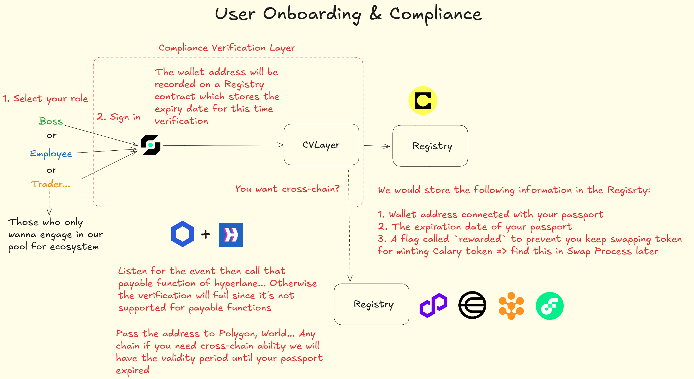

# User Onboarding & Compliance

Developers building consumer DApps can leverage Calary's streamlined KYC and cross-chain verification system, making it easier to onboard users while ensuring compliance. Here's how this will benefit developers:

### 1. **KYC via Self Protocol**

Developers can easily integrate Calary’s **Self Protocol** into their DApp, allowing users to submit basic passport details, such as nationality, age, and passport expiry. The system will handle validation for restricted regions (like North Korea or Iran), ensuring that your users are compliant without you needing to build complex KYC infrastructure.

**Key Benefits for Developers:**

- **Speedy KYC**: No need to build your own KYC infrastructure. You can use Calary’s existing protocol to verify users quickly.
- **Compliance Made Easy**: Automatically filter out restricted regions (North Korea, Iran, etc.) based on nationality and passport details, simplifying your compliance efforts.

### 2. **Registry on Celo**

Once the user has passed KYC, their wallet address, passport expiry date, and compliance flag are stored on the **Registry contract** on the **Celo** blockchain. This ensures that verified users are part of your compliant ecosystem and can be easily cross-referenced in future interactions with your DApp.

**Key Benefits for Developers:**

- **Immutable User Records**: Use blockchain technology to store verified user information securely and transparently.
- **Consistency Across Ecosystems**: With the Registry contract, you can ensure that user data is consistent across different chains, allowing you to build cross-chain solutions.

### 3. **Cross-Chain Verification with Hyperlane**

By leveraging **Hyperlane**, developers can easily transmit verified user information (like wallet address and passport expiry date) to other supported blockchains. This ensures that your DApp can maintain compliance across multiple ecosystems, making your DApp cross-chain ready.

**Key Benefits for Developers:**

- **Cross-Chain Compatibility**: Calary helps your DApp scale by ensuring that the user verification process is consistent across various blockchains, without needing custom solutions for each chain.
- **Easier Integration**: Developers can rely on Hyperlane to handle cross-chain user information without worrying about the technical details.

### 4. **User Compliance & Control**

Users have control over their verified data while developers can securely manage their user base for compliance. Calary’s approach ensures that users' data is stored transparently and verifiably, and it's tied to a specific user wallet. The information stored in the Registry contract can be queried and used for further compliance checks or reward eligibility in your DApp.

**Key Benefits for Developers:**

- **Seamless User Experience**: By handling the user verification process, developers can focus on building the core features of their DApp, leaving the compliance and onboarding to Calary.
- **Easy API Access**: Developers can query the Registry contract to retrieve information like user verification status or whether the user is eligible for rewards, saving time and resources when managing user interactions.

---

### **Use Cases for Developers**

With **User Onboarding & Compliance**, developers can easily build DApps that require verified users. Some potential use cases include:

- **Decentralized Finance (DeFi)**: Ensuring that only verified users can participate in your DeFi protocols, making your platform compliant with regulations.
- **NFT Marketplaces**: Verifying the identity of users before allowing them to mint or trade NFTs.
- **Gaming**: Verifying that players are compliant before allowing them to join certain events or tournaments.

In summary, **User Onboarding & Compliance** with Calary provides developers with an out-of-the-box, cross-chain KYC solution that ensures user verification is both secure and compliant. By integrating this into your DApp, you can focus on the core functionality while Calary handles the complex compliance and cross-chain verification, allowing you to build a reliable and scalable platform for your users.

---

---

---

# Payroll System

It's essentially a **distribution framework** that enables developers to manage and automate any kind of compensation or reward system, whether it’s salary, profit-sharing, performance-based incentives, or even one-time distributions. Let’s break down how this system works and how developers can use it to create different types of distribution mechanisms:

### 1. **Time-Based Payroll (Simple Distribution)**

This is the most straightforward option where distributions are made on a set time interval. Users or employees can claim their distribution at regular intervals, making it perfect for:

- **Salary Payments**: If you’re building an employee-focused DApp, this system can be used for regular salary payouts.
- **Stipends or Grants**: Distribute funds at regular intervals to users, such as educational grants or recurring rewards for participation in a community.

**How it works**:

- Employers (or developers) specify when users can start claiming their distribution and the interval for recurring payouts.
- This is an excellent fit for projects or DAOs that need predictable and regular reward mechanisms.

### 2. **Custom Logic Payroll (Advanced Distribution)**

For developers who want to implement more complex, performance-based, or conditional distributions, **Custom Logic Payroll** offers great flexibility. You can define custom rules that determine when and how distributions are made, using the `ICustomPayrollLogic` interface.

**Possible Use Cases**:

- **Performance-Based Incentives**: Distribute tokens or rewards based on individual performance metrics, project milestones, or user contributions.
- **Governance Rewards**: Implement a rewards system where users are compensated based on their voting power, participation in governance, or DAO activities.
- **Dynamic Staking Rewards**: Set up a staking rewards system where users earn more rewards the longer they stake or the more they contribute to a pool.

**How it works**:

- Developers implement the `ICustomPayrollLogic` interface, which defines two main functions:
  1. **Eligibility Check**: Determines whether a user is eligible for a distribution at any given time.
  2. **Amount Calculation**: Calculates the amount a user should receive based on their actions or conditions.

**Bonus**: You can also implement **zk-privacy** in this system, keeping distribution details private. For example, you can shield how much an employee earns or the exact rewards they receive. This is great for privacy-sensitive applications.

### 3. **Milestone-Based Payroll (Event-Triggered Distribution)**

**Milestone-Based Payroll** is an event-driven mechanism where users receive distributions based on predefined milestones being reached. These milestones can be on-chain (like completing a specific task or project) or off-chain (like meeting a certain sales target).

**Use Cases**:

- **Project Milestones**: Developers can use this to reward teams or individuals when they reach key project goals or deadlines.
- **Sales Commissions**: Distribute commissions to employees or partners when sales targets or revenue milestones are achieved.
- **Bounties or Contests**: Reward users for completing tasks or winning competitions.

**How it works**:

- Developers define **milestones** that trigger a distribution, and the system listens for **events** that signal milestone completion (similar to Chainlink’s log-trigger mechanism).
- Once an event is emitted (like a contract milestone being hit), the distribution is triggered automatically.

**Challenges**:

- To fully decentralize milestone tracking, you would need a decentralized node operator to listen to events and reach consensus on whether the milestone was met, which is more complex and not yet fully implemented in the current system.
- But for now, using event signatures is enough to trigger the payout, which is a quick and easy way to get started.

### 4. **General Distribution Use Cases (Beyond Payroll)**

In addition to the three core payroll types, Calary’s distribution framework can be applied to any scenario that involves distributing tokens, rewards, or assets to verified participants.

Some examples include:

- **Token Airdrops**: Distribute tokens to verified users based on certain criteria, such as holding a particular NFT, staking tokens, or engaging in a specific activity.
- **Loyalty Programs**: Set up a rewards program where users are rewarded for using your platform, completing tasks, or interacting with your ecosystem. This can be particularly useful for gaming DApps or marketplaces.
- **Equity Distributions (Tokenized Ownership)**: If your DApp has an ownership structure, such as a DAO or cooperative, use the distribution framework to share profits or tokenized shares with verified stakeholders.

**Key Benefits for Developers**:

- **Flexibility**: Whether you need time-based, performance-based, or event-driven distributions, you can choose the system that fits your needs and easily integrate it into your DApp.
- **On-Chain Transparency**: All distributions are transparent and on-chain, giving users visibility into how and when they will receive their rewards or payments.
- **Customizability**: The **Custom Logic Payroll** allows developers to define their own rules, making it possible to implement any kind of reward structure you can imagine, all while keeping it flexible for different use cases.
- **Privacy**: The potential to add **zk-privacy** features gives developers the ability to keep sensitive distribution information private, a valuable feature for privacy-conscious applications.

### 5. **Integration with Calary’s Ecosystem (Swap & Incentives)**

The distribution system can also be tied into **Calary’s Swap Infrastructure**. Users who participate in the payroll or distribution system can earn **Calary tokens** (the native token), which can be redeemed for various perks such as ENS names, event tickets, or even physical goods. This creates a **win-win incentive** for both employers and employees (or users) to engage with the platform and participate in your DApp’s ecosystem.

For example:

- **Employee Swaps**: Users who engage in the payroll system (by claiming their salary) can swap tokens and earn **Calary** tokens as part of the reward mechanism.
- **Liquidity Providers (LPs)**: Employers can act as liquidity providers, adding USDC or other assets to a pool, while employees or users receive rewards for participating in the system.

---

### **Use Cases for Developers**:

- **DAOs and Governance**: Use milestone-based or custom logic payroll to distribute governance tokens, rewards, or compensation to DAO members.
- **Freelancer Platforms**: Enable freelancers to get paid for their work with a customizable payroll system that could be based on hourly work, project completion, or performance.
- **Content Creators & Influencers**: Distribute earnings to content creators based on engagement, views, or subscriber counts, all of which are on-chain and transparent.
- **Subscription-Based Services**: If you’re building a subscription service, you can automate payments to creators, service providers, or even distribute tokenized rewards for active participation.

---

### In Summary

Calary’s **Payroll System** provides a flexible, customizable framework that goes far beyond traditional payroll, allowing developers to create robust distribution models for any kind of reward or incentive structure in their DApp. Whether you’re building a DeFi platform, a community-based project, a DAO, or even a freelance platform, Calary’s payroll system ensures that your users can receive distributions in a transparent, automated, and secure way—while keeping the process fully customizable.

---

---

---

# Swap Infrastructure & Incentives

It’s not just about swapping tokens, but integrating a **reward mechanism** that incentivizes users to engage in the ecosystem while maintaining compliance. Let’s break down how this system works and how it benefits developers in building DApps with integrated swap features.

### 1. **Compliant Swaps with Verification**

Calary’s swap infrastructure is built with **compliance at the forefront**. Before a swap is executed, a **beforeSwap hook** checks whether the user has been verified through the **Registry contract** (i.e., they have completed the KYC process via the **Self Protocol**). If the user is not verified, they are **blocked from swapping**, ensuring that only compliant users are allowed to participate in the ecosystem.

**How it works**:

- The **beforeSwap hook** queries the Registry contract to check the user’s verification status.
- If the user is verified, they can proceed with the swap; if not, the swap is rejected.

**Key Benefits for Developers**:

- **Seamless Compliance**: You don’t have to build your own verification checks—Calary ensures only compliant users are allowed to swap.
- **Trusted Ecosystem**: By restricting swaps to verified users, you ensure the integrity and security of your DApp and its participants.

### 2. **Incentives for Participation**

The most exciting aspect of Calary’s swap infrastructure is the **incentive system** tied to user behavior, particularly in the context of participating in the payroll system.

#### **Rewarding Payroll Participants**

For users who have participated in Calary’s payroll system (either through time-based, custom logic, or milestone-based payroll), there’s a unique reward mechanism that makes them eligible for **Calary tokens** when they participate in swaps. Here’s how it works:

- The **afterSwap hook** checks the user’s **rewarded flag** on the Registry contract.
  - If the user has **never claimed their salary** or rewards from the payroll system, the `rewarded` flag is set to **True**. This means that no additional rewards will be minted for that user during the swap.
  - If the user **has claimed a reward** (e.g., salary), the `rewarded` flag will be set to **False**. When they perform a swap, the **afterSwap hook** will trigger and mint **Calary tokens** as a reward.

**What the minted tokens do**:

- The minted **Calary tokens** act as **credentials**, which users can redeem for perks like:
  - **ENS Names**: Free ENS domain registration, helping users secure a personalized web3 identity.
  - **Event Tickets**: Tickets for events like hackathons, meetups, and other developer or blockchain-related activities.
  - **Physical Goods**: Potential to redeem tokens for physical rewards, such as clothing or merchandise from partners (depending on the partnerships Calary establishes).

**Key Benefits for Developers**:

- **Incentivize User Engagement**: By rewarding users who participate in the payroll system, you encourage greater interaction and retention on your platform.
- **Token Redemption Ecosystem**: Calary tokens become a versatile tool for creating an ecosystem of rewards, keeping users engaged and motivated to participate in your platform over the long term.

### 3. **Liquidity Providers (LPs)**

Calary’s infrastructure also includes **liquidity pools** for users who want to participate in liquidity provision. By providing liquidity to the pool, users can earn **swap fees** while being part of the system’s reward structure.

**How it works**:

- Users can provide liquidity (such as USDC or other assets) to the swap pool.
- As a liquidity provider (LP), they earn a share of the swap fees generated from the transactions taking place on the platform.

**Key Benefits for Developers**:

- **Boost Liquidity**: By incentivizing users to become LPs, you increase the liquidity on your platform, which improves swap efficiency and reduces slippage.
- **Revenue for LPs**: Liquidity providers are rewarded with swap fees, creating a mutually beneficial arrangement that encourages participation in the ecosystem.
- **DeFi Ecosystem Integration**: This feature allows your platform to integrate with existing decentralized finance (DeFi) protocols, encouraging liquidity to flow in and out of your platform.

### 4. **Custom Swap Pools & RWAs (Real-World Assets)**

One of the standout features of Calary’s swap infrastructure is its ability to handle **real-world assets (RWAs)**, which can be integrated into the swap pools. For example, a startup might not have enough USDC to pay employees, so they may opt to pay part of the salary in **stock shares** or other assets. Calary allows these RWAs to be integrated into the swap pool for seamless exchanges.

**How it works**:

- A **startup** can work with Calary to add an RWA (like stock shares or real estate-backed tokens) to the swap pool.
- The platform ensures compliance by verifying the eligibility of these assets (similar to how it verifies users), and then they become tradable within the swap system.

**Key Benefits for Developers**:

- **Diverse Asset Types**: You can support a variety of asset types in your platform, broadening the scope of what users can trade and interact with.
- **RWA Compliance**: Calary provides compliance checks for real-world assets, ensuring that tokenized RWAs are compliant before they’re used in swaps.
- **Customization**: This enables developers to tailor the swap mechanism to suit specific business models that rely on tokenized versions of real-world assets.

### 5. **Anti-Fraud & Abuse Prevention**

To prevent users from exploiting the reward system, Calary uses the **rewarded flag** mechanism. The flag ensures that users who frequently swap without engaging in the payroll system (or abusing the system) are not able to continuously mint Calary tokens.

**How it works**:

- If a user has already received a reward from a previous swap, their `rewarded` flag is set to **True**, preventing them from being rewarded again until they claim their next salary or engage in a distribution.
- This **prevents abuse**, ensuring that only active participants in the payroll system (or reward systems) benefit from the swap rewards.

**Key Benefits for Developers**:

- **Fairness**: The system ensures that only eligible users receive rewards, preventing users from gaming the system by repeatedly swapping for rewards.
- **Transparent Reward Mechanism**: By using blockchain technology, the reward distribution is fully transparent and immutable, allowing users to track their own reward status and activity.

### 6. **Benefits for DApp Developers**

By integrating **Calary’s Swap Infrastructure** into your DApp, you unlock several key benefits:

- **Cross-Chain Compatibility**: The swap infrastructure supports multiple chains, so you can integrate swaps and liquidity pools across different blockchains, increasing the reach of your DApp.
- **EVM Compatibility**: Calary is compatible with **EVM chains**, so you can deploy and integrate the system with existing blockchain networks, enabling you to leverage popular DeFi protocols.
- **Customizable Reward Systems**: The reward infrastructure is flexible, allowing you to design your own incentives for users (e.g., different kinds of rewards or access to specific content/functionalities).
- **Efficient Token Distribution**: Automatically minting and distributing **Calary tokens** helps create a healthy ecosystem, where active users are incentivized to engage with the platform and continue interacting.

---

### **In Summary**

Calary’s **Swap Infrastructure & Incentives** system is more than just a mechanism for token swapping; it’s a way to engage users, incentivize participation, and integrate compliance and rewards into your DApp seamlessly. Whether you’re building a **DeFi platform**, a **freelance marketplace**, a **DAO**, or any application requiring token swaps or liquidity, Calary’s swap system provides the infrastructure to ensure both compliance and incentives for all participants, while also enabling the distribution of rewards like **Calary tokens**, which can be redeemed for perks and services.
